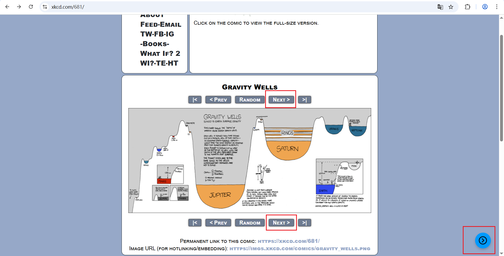

[English](#english) | [简体中文](#简体中文)

---

<h2 id="english">English</h2>

# URL Incrementer 🚀

A simple Chrome extension that adds a floating button to the page, allowing you to navigate to the next page with a single click by incrementing the last number in the URL.

Perfect for browsing forums, manga sites, or paginated articles!

### 💡 How It Works: URL Incrementing Examples

The extension intelligently finds the *last* number in the current URL and increases it by one. Here are a few examples:

**Case 1:**
- **Before:** `https://xkcd.com/681/`
- **After Click:** `https://xkcd.com/682/`

**Case 2:**
- **Before:** `https://500px.com/`
- **After Click:** `https://501px.com/`

**Case 3:**
- **Before:** `https://readmanga.com/series/1/title/chapter-1053.html`
- **After Click:** `https://readmanga.com/series/1/title/chapter-1054.html`

### ✨ Features

- **One-Click Navigation:** No more manually editing the URL.
- **Floating Button:** Easy access right on the page.
- **Smart Detection:** The button only appears on pages where it can actually be used.
- **Icon-Based:** Clean and intuitive user interface.

### 🔧 How to Install (from GitHub)

1.  **Download the Code:**
    *   Click the green **`< > Code`** button on the top right of this page.
    *   Select **"Download ZIP"**.

2.  **Unzip the File:**
    *   Find the downloaded `URL-Incrementer-for-Chrome-Extensions-main.zip` file on your computer.
    *   Unzip it. You will find a folder named `URL_Incrementer_Chrome_Extensions`.

3.  **Load into Chrome:**
    *   Open your Chrome browser and navigate to `chrome://extensions`.
    *   Turn on the **"Developer mode"** switch in the top right corner.
    *   Click the **"Load unpacked"** button that appears on the top left.
    *   In the file selection window, select the **entire `URL_Incrementer_Chrome_Extensions` folder** you just unzipped.

That's it! The "URL Incrementer" extension is now installed and ready to use.

### 🤖 AI Collaboration Notice

This project was brought to life through a collaborative effort between the developer and Google's AI model, Gemini 2.5 Pro.

---
---

<h2 id="简体中文">简体中文</h2>

# URL Incrementer 🚀

一个简洁的Chrome浏览器扩展程序。它会在符合条件的页面上添加一个悬浮按钮，让你通过单击增加URL中的最后一个数字，从而轻松跳转到下一页。

非常适合用于浏览论坛、漫画网站或任何分页形式的文章！

### 💡 工作原理：URL自增示例

该扩展会智能地查找当前URL中的**最后一个**数字，并将其加一。这里是一些例子：

**用例一：**
- **点击前:** `https://xkcd.com/681/`
- **点击后:** `https://xkcd.com/682/`

**用例二：**
- **点击前:** `https://500px.com/`
- **点击后:** `https://501px.com/`

**用例三：**
- **点击前:** `https://readmanga.com/series/1/title/chapter-1053.html`
- **点击后:** `https://readmanga.com/series/1/title/chapter-1054.html`

### ✨ 功能特性

- **一键翻页:** 无需再手动修改地址栏，点击悬浮按钮即可。
- **悬浮按钮:** 操作便捷，按钮会直接显示在页面上。
- **智能检测:** 仅在URL包含数字、能够进行翻页操作的页面上显示按钮。
- **图标界面:** 使用直观的图标作为按钮，界面干净。

### 🔧 如何安装 (从GitHub)

1.  **下载代码:**
    *   在此页面右上角，点击绿色的 **`< > Code`** 按钮。
    *   在下拉菜单中选择 **"Download ZIP"**。

2.  **解压文件:**
    *   在你的电脑上找到下载好的 `URL-Incrementer-for-Chrome-Extensions-main.zip` 文件。
    *   解压它。你会找到一个名为 `URL_Incrementer_Chrome_Extensions` 的文件夹。

3.  **加载到Chrome浏览器:**
    *   打开Chrome浏览器，在地址栏输入 `chrome://extensions` 并回车。
    *   在页面右上角，打开 **“开发者模式”** 的开关。
    *   此时左上角会出现一个新的 **“加载已解压的扩展程序”** 按钮，点击它。
    *   在弹出的文件选择窗口中，选择你刚刚解压出来的整个 **`URL_Incrementer_Chrome_Extensions`** 文件夹。

完成！现在，你的浏览器中已经成功安装了 "URL Incrementer" 扩展程序，可以开始使用了。

### 🤖 AI协作声明

本项目是在开发者与Google的AI模型Gemini 2.5 Pro的合作下完成的。
